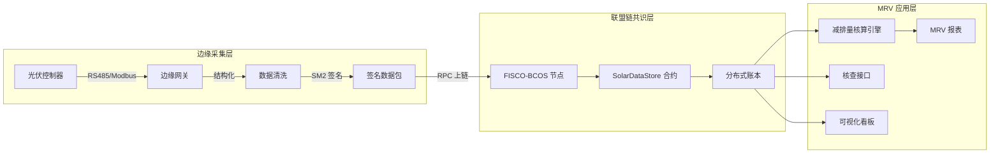
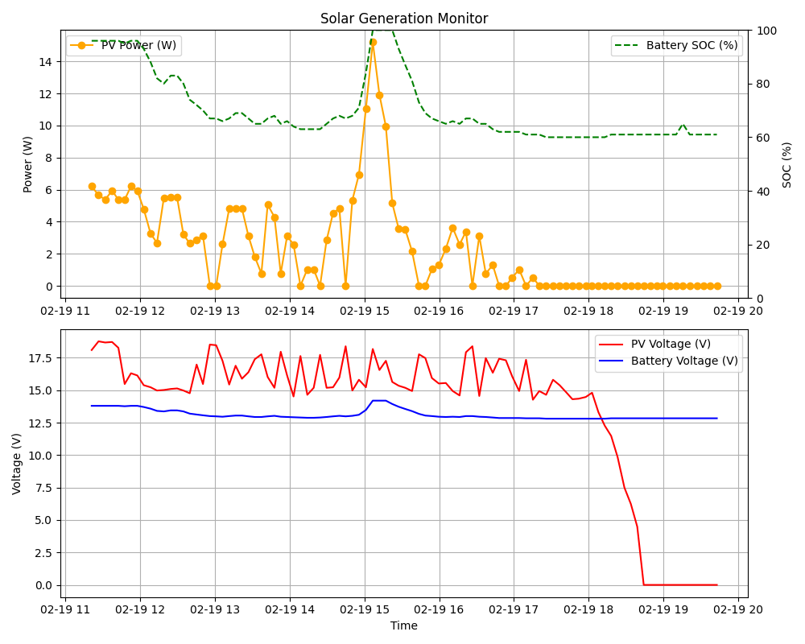

# 绿链未来 SolarMRV — 分布式光伏 MRV 可信数据底座

> **基于国密与联盟链的分布式光伏减排量可信核算与碳资产数据底座**
>
> 项目状态：原型验证完成，正进入校园 PoC 试运行阶段
> 项目周期：2026.05 – 2027.05（大学生创新创业训练计划 · 创业训练项目）
> 在线试运行：已完成云端部署技术验证（基础设施已下线归档）

---

## 项目定位更新声明（2026-02）

本项目早期原型阶段曾以"分布式光伏环境权益数字化"为技术探索口径。**结合 2026 年初监管环境变化（八部门关于现实世界资产代币化业务的政策口径），团队主动完成项目定位的合规规范化调整**，将项目重新定位为"分布式光伏 MRV（监测—报告—核查）可信数据底座"，剥离全部金融化属性，仅保留底层可信数据采集、签名、存证与核查能力。

**当前项目严格遵守以下合规边界：**

- 不开展任何金融化资产发行与流转
- 不撮合任何形式的交易、流转或募资
- 不向公众承诺任何收益分配
- 链上记录不可转让、不可流通，仅作为发电数据与减排量核算过程的可信留痕

早期原型阶段的探索性合约已归档至 [`contracts/deprecated/`](contracts/deprecated/)，仅作技术演进留痕，不再部署或调用。早期版本商业计划书与项目报告已归档至 [`项目总结报告内容/历史版本/`](项目总结报告内容/历史版本/)，仅作团队材料完整性保留。

**项目当前对外正式材料以 [`最新执行计划/`](最新执行计划/) 目录内文件为准。**

---

## 1. 项目目标

构建一套面向分布式光伏场景的**可信 MRV 数据底座**，解决分布式光伏在 CCER 申报、第三方核查、园区碳管理、企业 ESG 披露与 CBAM 绿电出口证明等场景中底层数据"难证明、难追溯、难复核"的核心痛点。

项目以真实光伏设备数据为起点，构建端到端的五步可信链路：

```
设备直采 → 国密 SM2 签名 → FISCO-BCOS 联盟链存证 → 减排量核算 → 第三方核查接口
```

将原本分散、易篡改、难复核的发电数据，转化为可验证、可复算、可被第三方核查机构采信的减排量记录。

## 2. 系统架构



## 3. 技术栈

| 层 | 技术 | 说明 |
|----|------|------|
| 边缘采集 | Python + pyserial | RS485/Modbus 协议读取光伏控制器 |
| 密码学 | 国密 SM2 / SM3 | 边缘端数字签名，符合《商用密码管理条例》|
| 联盟链 | FISCO-BCOS | 金链盟主导的国产合规联盟链 |
| 智能合约 | Solidity（纯数据合约） | 仅存证，无价值转移逻辑 |
| 后端 API | Python Flask | 轻量化 API 网关 |
| 前端 | Next.js + TailwindCSS（原型已归档） | 业主看板原型，下一阶段使用 Claude 重新生成 MRV 看板 |
| 部署 | Nginx + Systemd + DNSPod | 云端部署技术验证（已下线归档，校内环境重新部署中） |

## 4. 当前进展

### 已完成（原型验证阶段）

- ✅ 光伏控制器 RS485 数据采集与连续监测
- ✅ SM2 数字签名与可信数据包封装
- ✅ FISCO-BCOS 联盟链客户端与单节点存证
- ✅ 自动监测守护进程（含图表生成与告警推送）
- ✅ Next.js 前端业主看板原型（已归档，下一阶段使用 Claude 重新生成 MRV 看板）
- ✅ Nginx + Systemd 云端部署技术验证（基础设施已下线归档）
- ✅ 8 小时连续耐久测试（2026-02-19，96 个采样点零错包、零丢失）
- ✅ 独立域名 `pluviohan.com` 云端部署技术验证（基础设施已下线归档）

### 项目周期内拟建设（2026.05 – 2027.05）

- 🚧 MRV 减排量核算引擎（CCER 方法学 + 排放因子库 + 报表生成）
- 🚧 第三方核查接口（RESTful API + API Key + 审计日志）
- 🚧 合规数据合约扩展（方法学版本、排放因子版本、减排量字段）
- 🚧 多节点联盟链联调（业主 / 运营 / 核查 / 监管角色分离）
- 🚧 核查机构专用前端页面
- 🚧 校园内 PoC 原型试运行
- 🚧 知识产权产出（3 份软著申请 + 1 份发明专利申请）

## 5. 项目目录结构

```
光伏项目/
├── README.md                       # 本文件
├── LICENSE                         # MIT 协议
├── SECURITY.md                     # 安全策略与合规边界
├── requirements.txt                # Python 依赖清单
├── .env.example                    # 环境变量模板
├── pytest.ini                      # 测试配置
│
├── solar_monitor.py                # 光伏数据采集 + SM2 签名
├── auto_monitor.py                 # 自动监测守护进程
├── chain_client.py                 # FISCO-BCOS 联盟链客户端
├── chain_relay_v2.py               # 链上数据上传中继
├── wallet_manager.py               # 密钥管理
├── telegram_notify.py              # 告警通知
├── config.py                       # 系统配置（从 .env 读取）
│
├── api/                            # 后端 API 服务
│   └── app.py                      # Flask 入口
├── contracts/                      # 智能合约
│   ├── SolarDataStore.sol          # 纯数据存证合约（在用）
│   ├── SolarDataStore.abi
│   └── deprecated/                 # 早期 RWA 合约（已停用归档）
│
├── data/                           # 采集 CSV 数据（wallets/ 已 gitignore）
├── assets/                         # README 引用图片
│   └── deprecated/                 # 旧 RWA 前端截图归档
├── charts/                         # 监测图表输出
├── logs/                           # 运行日志
│
├── scripts/                        # 人工执行的辅助脚本
│   └── chain-ops/                  # FISCO-BCOS 节点运维 shell 脚本
├── tests/                          # pytest 测试
│   ├── conftest.py
│   └── deprecated/                 # 早期 RWA/DEX 测试归档
├── utils/                          # 工具脚本（extract_pdf / debug_load / deploy_chain_cloud）
│
├── 政策资料/                       # 政策、监管、绿证、数字金融资料库
├── 比赛材料/                       # 历史比赛申报材料（BP / 视觉规范 / 素材）
├── 项目总结报告内容/               # 项目总结与申请材料
│   └── 历史版本/                   # 早期阶段材料归档
└── 最新执行计划/                   # 当前对外正式材料（以此为准）
    ├── 01_BP_碳核算MRV调整版.md
    ├── 02_代码与技术执行计划.md
    ├── 03_软著与专利申请执行计划.md
    ├── 04_国省级大创提交清单与时间表.md
    ├── 05_国省级大创项目申请书_创业训练项目_正文稿.md
    ├── 06_国省级大创项目申请书_500字简介草稿.md
    └── 07_05正文写作纲要.md
```

## 6. 实验验证

### 8 小时连续耐久测试（2026-02-19）

- 真实分布式光伏系统自然充放电周期
- 持续时长：8 小时
- 采样验证点：96 个
- 错包率：0
- 丢失率：0
- 链上写入成功率：100%



*（图注：2026-02-19 完成的真实光伏系统自然充放电周期耐久测试图，记录光照与功率随负载的连续变化。）*

### 在线试运行入口

[`http://pluviohan.com`](http://pluviohan.com) — 项目原型已完成云端部署技术验证与 8 小时连续耐久测试，相关采集数据与图表保留于项目仓库；当前基础设施已下线归档，将依托校内环境重新部署。

## 7. 应用场景

项目面向以下场景设计（**不承诺结题前完成外部场景落地**）：

- **CCER 申报咨询**：为咨询机构提供 MRV 数据底座，提升 CCER 项目申报材料的数据可信度
- **第三方核查机构**：通过专用核查接口降低现场抽查工作量
- **园区碳管理**：为园区与企业内部碳资产台账提供可信数据源
- **企业 ESG 披露**：为 ESG 披露提供连续、可追溯的发电与减排量记录
- **CBAM 绿电出口证明**：为出口企业提供可被欧盟核查机构采信的绿电使用证据链

## 8. 合规边界

本项目严格遵守以下合规边界：

| 不做的事 | 做的事 |
|----------|--------|
| 不发行任何金融化代币或通证 | 仅在联盟链上记录设备真实发电数据 |
| 不撮合任何交易或二级流转 | 仅按国家方法学折算减排量电子记录 |
| 不开展公众募资 | 链上记录不可转让、不可流通 |
| 不承诺任何收益分配 | 仅服务已签约的 B 端核查与咨询场景 |

详细合规分析见 [`政策资料/政策与合规环境分析初稿.md`](政策资料/政策与合规环境分析初稿.md)。

## 9. 文档导航

| 文件 | 用途 |
|------|------|
| [`最新执行计划/01_BP_碳核算MRV调整版.md`](最新执行计划/01_BP_碳核算MRV调整版.md) | 当前对外商业计划书 |
| [`最新执行计划/02_代码与技术执行计划.md`](最新执行计划/02_代码与技术执行计划.md) | 代码与技术推进计划 |
| [`最新执行计划/03_软著与专利申请执行计划.md`](最新执行计划/03_软著与专利申请执行计划.md) | 知识产权产出计划 |
| [`最新执行计划/05_国省级大创项目申请书_创业训练项目_正文稿.md`](最新执行计划/05_国省级大创项目申请书_创业训练项目_正文稿.md) | 国省级大创申报书正文 |
| [`最新执行计划/06_国省级大创项目申请书_500字简介草稿.md`](最新执行计划/06_国省级大创项目申请书_500字简介草稿.md) | 项目简介定稿 |
| [`最新执行计划/04_国省级大创提交清单与时间表.md`](最新执行计划/04_国省级大创提交清单与时间表.md) | 国省级大创提交清单与时间表 |
| [`最新执行计划/07_05正文写作纲要.md`](最新执行计划/07_05正文写作纲要.md) | 05 正文写作纲要 |
| [`政策资料/`](政策资料/) | 政策、监管、绿证、数字金融资料库 |

## 10. 团队

绿链未来项目团队 · 五人核心成员（CEO / CTO / CFO / CMO / CDO）。成员背景覆盖数字经济、信息管理与信息系统、金融科技、数据分析、前端工程、区块链应用、政策研究等方向，由校内指导教师与校外导师共同支持。

---

## 协议

本项目代码以学术研究与创新创业训练为目的开源。商业引用请联系团队。

## 联系方式

如需进一步了解项目或开展合作探索，请通过 GitHub Issues 联系。
